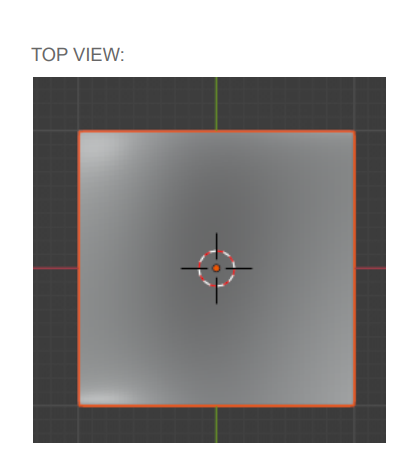

# CoonsPatch
A basic implementation of Coon's Patch in Blender using Blender scripting.

## Introduction
A Coons patch is a mathematical construct employed in computer graphics to create a continuous transition between surfaces, as well as in finite element method and boundary element method in computational mechanics to create meshed elements for problem domains.

## Implementation
The coon's patch is constructed by reading co-ordinates from the text file "coons_patch_points". Each four lines in the file contains the control points of a Bezier curve. For each curve each two lines contains one endpoint of the bezier curve and it’s adjacent control point respectively. These four sets of control points determine the boundary of your Coons patch.

## Results
The results of the coon's patch generated are as follows:

3D View

